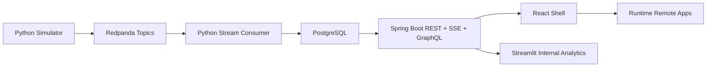
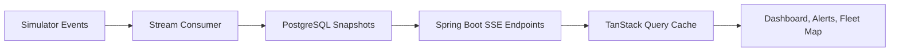
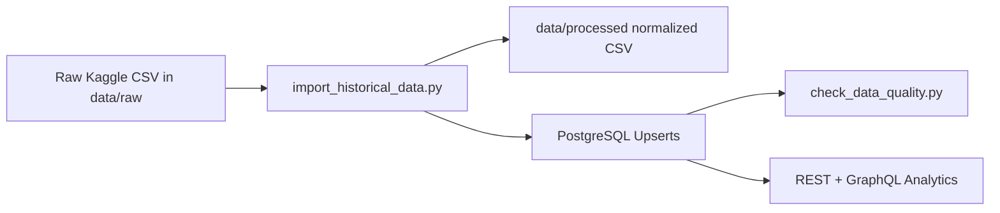

# LogiTrack Control Tower

LogiTrack Control Tower is a frontend-focused full-stack portfolio project for monitoring logistics operations in near real time. It shows dashboard KPIs, delivery tracking, alert handling, analytics, fleet monitoring, and runtime micro-frontends backed by Spring Boot, PostgreSQL, Redpanda-compatible streaming, and Python simulator/consumer services.

## Project Overview

LogiTrack helps an operations team answer:

- How many deliveries are active, delayed, or completed?
- Which alerts need attention now?
- Which vehicles are active, idle, offline, or under maintenance?
- Which regions, drivers, or vehicles are causing delivery delays?
- How does live event data move from simulator to database to UI?

## Target Role

This project is designed to demonstrate skills expected from a frontend developer working with React, TypeScript, API integration, real-time updates, data visualization, dashboard UX, performance-aware UI development, and full-stack collaboration.

## Current Completion Status

| Phase | Area | Status | Evidence |
|---|---|---|---|
| Phase 1 | Planning, scope, architecture notes | Completed | README and docs exist |
| Phase 2 | React shell foundation | Completed | `apps/shell`, routing, shared UI primitives |
| Phase 3 | Spring Boot + PostgreSQL REST foundation | Completed | backend service, schema, seed data, Docker Compose |
| Phase 3B | Redpanda simulator pipeline | Completed | `data-simulator`, `stream-consumer`, Redpanda topics |
| Phase 4 | REST integration and live dashboard/alerts | Completed | TanStack Query API client, dashboard/alert SSE helpers |
| Phase 5 | REST analytics | Completed | `/api/analytics/summary`, analytics tables and charts |
| Phase 6 | Testing and performance foundations | Partially completed | frontend tests/build scripts exist; manual profiler captures pending |
| Phase 7 | Runtime micro-frontends | Implemented, evidence pending | shell + analytics/fleet/delivery/alert remotes; route screenshots pending |
| Phase 8 | Fleet Map and Vehicle Detail | Implemented, evidence pending | React Leaflet map, selected panel, detail route; screenshots pending |
| Phase 9 | Kaggle historical import | Partially completed | sample importer implemented; 5k+ raw Kaggle import verification pending |
| Phase 10 | Advanced Fleet Map live updates | Implemented, evidence pending | `/api/live/vehicles`, marker throttling; manual SSE marker proof pending |
| Phase 11 | GraphQL advanced analytics | Implemented, evidence pending | `POST /graphql`, analytics remote GraphQL client; smoke evidence pending |
| Phase 12 | Internal Streamlit analytics service | Implemented, evidence pending | `analytics-service` Docker service; screenshots pending |
| Phase 13 | Large dataset performance proof | Partially completed | table virtualization implemented; 10k+ dataset scroll proof pending |
| Phase 14 | Final CI/CD, screenshots, runbook | Partially completed | CI workflow and runbook exist; CI link and screenshots pending |
| Hosted deployment | Public production hosting | Out of scope | local Docker demo is the target |
| Auth/security hardening | Authentication and authorization | Out of scope | portfolio demo scope |

## Tech Stack

- Frontend: React, TypeScript, Vite, React Router, TanStack Query
- Micro-frontends: Vite Module Federation shell and remotes
- UI/data visualization: shared UI package, React Leaflet, Plotly, D3
- Backend: Spring Boot, REST, Spring GraphQL
- Data: PostgreSQL, SQL seed data, Kaggle-compatible historical import script
- Realtime: Server-Sent Events, Redpanda/Kafka-compatible topics
- Services: Python data simulator, Python stream consumer, Streamlit internal analytics panel
- Verification: Vitest/React Testing Library, Maven in CI, Docker Compose, API verification script

## Features

- Operations dashboard with KPI cards, delivery status summary, and recent alerts.
- Delivery management and alert center backed by shared API client types.
- Alert resolve action through `PATCH /api/alerts/{id}/resolve`.
- Fleet Map remote with OpenStreetMap tiles, status-based markers, marker legend, selected vehicle panel, and vehicle detail route.
- Live dashboard, alerts, and vehicle snapshots through SSE.
- Analytics remote using GraphQL `deliveryAnalytics` for Plotly trend, D3 heatmap, route efficiency, and performance tables.
- Internal Streamlit service for PostgreSQL-backed data quality and analytics review.
- Shared workspace packages for UI primitives, domain types, and API clients.

## Architecture

Detailed diagrams live in:

- [Architecture](docs/architecture.md)
- [Diagrams](docs/diagrams.md)
- [Data lineage](docs/data-lineage.md)
- [Micro-frontend notes](docs/micro-frontend.md)

Core runtime flow:



SSE event flow:



Kaggle import flow:



## Screenshots

Final screenshots should be stored in `docs/screenshots/` using these filenames:

- `dashboard.png`
- `deliveries.png`
- `alerts.png`
- `analytics.png`
- `fleet-map.png`
- `fleet-selected-vehicle.png`
- `vehicle-detail.png`
- `streamlit-data-quality.png`
- `streamlit-analytics.png`
- `shell-analytics-remote.png`
- `shell-fleet-remote.png`

Screenshot capture is part of Phase 14 evidence. The repository does not currently include verified screenshot files, so screenshot-dependent claims remain `evidence pending` in the status table.

## Local Setup

Install frontend dependencies:

```bash
pnpm install
```

Run backend, database, event pipeline, and internal analytics service:

```bash
docker compose up --build
```

Run the integrated shell and remotes:

```bash
pnpm dev
```

`pnpm dev` builds the remotes first and then runs preview servers so federated `remoteEntry.js` files are available to the shell.

## Environment Variables

- `VITE_API_BASE_URL`: frontend API base URL. Defaults to `http://localhost:8080`.
- `DATABASE_URL`: PostgreSQL connection string for Python scripts and Streamlit.
- `KAFKA_BOOTSTRAP_SERVERS`: Redpanda/Kafka-compatible broker address for Python services.
- `LOGITRACK_CORS_ALLOWED_ORIGIN`: backend CORS allow-list.

See [.env.example](.env.example).

## Docker Compose Setup

Services:

- `postgres`: PostgreSQL on `localhost:55432`
- `backend-api`: Spring Boot API on `localhost:8080`
- `redpanda`: Kafka-compatible broker on `localhost:19092`
- `data-simulator`: Python logistics event producer
- `stream-consumer`: Python event consumer and PostgreSQL writer
- `analytics-service`: Streamlit internal analytics UI on `localhost:8501`

Useful commands:

```bash
docker compose down -v
docker compose up --build
docker compose build backend-api analytics-service
docker compose up analytics-service
```

## Micro-Frontend Runtime

Route ownership:

- Shell: `/`, `/dashboard`
- Delivery Management remote: `/deliveries`
- Alert Center remote: `/alerts`
- Analytics remote: `/analytics`
- Fleet Dashboard remote: `/fleet`, `/fleet/vehicles/:id`

Development and preview ports:

- Shell host: `http://localhost:5173`
- Analytics remote: `http://localhost:5174`
- Fleet Dashboard remote: `http://localhost:5175`
- Delivery Management remote: `http://localhost:5176`
- Alert Center remote: `http://localhost:5177`

Standalone commands:

```bash
pnpm dev:analytics
pnpm dev:fleet
pnpm dev:delivery
pnpm dev:alerts
```

Preview commands:

```bash
pnpm preview:shell
pnpm preview:analytics
pnpm preview:fleet
pnpm preview:delivery
pnpm preview:alerts
```

Remote fallback behavior is handled with shell route boundaries and shared fallback UI. Manual proof with a disabled remote is still evidence pending.

## API Endpoints

REST:

- `GET /api/health`
- `GET /api/dashboard/summary`
- `GET /api/deliveries`
- `GET /api/alerts`
- `PATCH /api/alerts/{id}/resolve`
- `GET /api/vehicles`
- `GET /api/vehicles/{id}`
- `GET /api/analytics/summary`

SSE:

- `GET /api/live/dashboard`
- `GET /api/live/alerts`
- `GET /api/live/vehicles`

GraphQL:

- `POST /graphql`
- Query: `deliveryAnalytics(from: String, to: String, region: String)`

Full request/response examples are documented in [API contract](docs/api-contract.md).

## Dataset Strategy

Current runtime data uses:

- PostgreSQL seed data for deterministic demo state.
- Python simulator events for live location, delivery status, delay, and alert behavior.
- Stream consumer persistence back into PostgreSQL.
- Kaggle-compatible historical import scripts for analytics volume.

Kaggle status: sample importer implemented; large dataset verification pending. The committed sample fixture proves the import path, but Phase 9 is only complete after at least 5,000 historical deliveries are imported from a locally downloaded Kaggle CSV and pass data quality checks.

Raw Kaggle CSV files are not committed to the repository. Put downloaded files under `data/raw/`.

Import workflow:

```bash
python scripts/import_historical_data.py --csv data/sample/historical_deliveries_sample.csv --dry-run
python scripts/import_historical_data.py --csv data/raw/<kaggle-file>.csv
python scripts/check_data_quality.py
```

More detail:

- [Dataset selection](docs/dataset-selection.md)
- [Data quality](docs/data-quality.md)
- [Data lineage](docs/data-lineage.md)

## Data Quality

The quality script checks duplicate delivery tracking numbers, missing region/status values, vehicle and driver foreign-key orphans, negative delay minutes, missing vehicle coordinates, date range, and delivery status distribution.

Phase 9 completion requires:

- At least 5,000 imported historical delivery rows.
- Zero critical data quality failures.
- Analytics verification through REST or GraphQL with imported rows.

## Streamlit Internal Analytics

The Streamlit service is an internal data review panel, not the customer-facing product UI.

Run it with:

```bash
docker compose up --build analytics-service
```

Open:

```text
http://localhost:8501
```

It reads PostgreSQL through `DATABASE_URL` and includes:

- Data quality overview
- Delay distribution
- Region breakdown
- Driver rankings
- Vehicle rankings

Screenshots for this service are still evidence pending.

## Testing and Verification

Latest local verification on 2026-05-26:

- `pnpm lint`: passed for shell and all remotes.
- `pnpm test`: passed with 8 test files and 21 tests.
- `pnpm build`: passed for analytics, fleet, delivery, alerts, and shell; Vite reports a large analytics chunk warning.
- `python scripts/import_historical_data.py --csv data/sample/historical_deliveries_sample.csv --dry-run`: passed with 5 normalized sample rows.
- `docker compose build backend-api analytics-service`: passed.
- `.\scripts\verify-api.ps1`: passed for health, dashboard, deliveries, alerts, vehicles, and analytics endpoints.
- `POST /graphql` smoke checks: passed for no filter, region, date range, and combined filters.
- `http://localhost:8501`: returned HTTP 200 for Streamlit.
- `/api/live/vehicles`: returned vehicle SSE snapshot events.
- Shell route HTTP smoke: `/dashboard`, `/deliveries`, `/alerts`, `/analytics`, `/fleet`, and `/fleet/vehicles/VHL-001` returned HTTP 200 from preview.
- Standalone remote HTTP smoke: ports `5174`, `5175`, `5176`, and `5177` returned HTTP 200; all four `remoteEntry.js` URLs returned HTTP 200.
- `python scripts/check_data_quality.py`: blocked locally because `psycopg` is not installed in the active Python environment; equivalent SQL spot checks passed through the PostgreSQL container.

Frontend:

```bash
pnpm lint
pnpm test
pnpm test:frontend
pnpm build
```

Backend/API:

```powershell
docker compose build backend-api analytics-service
docker compose up -d
.\scripts\verify-api.ps1
```

CI:

- `.github/workflows/ci.yml` contains frontend lint/test/build and backend Maven test/package jobs.
- Latest GitHub Actions run evidence is still pending in `docs/final-verification.md`.

Full verification runbook:

- [Final verification](docs/final-verification.md)

## Performance Notes

Manual React DevTools Profiler captures are still pending. Current implemented performance foundations:

| Screen | Initial render | Interaction tested | Result | Notes |
|---|---:|---|---|---|
| Dashboard | Pending manual capture | SSE update | Evidence pending | dashboard/alert SSE cache updates are coalesced |
| Alerts | Pending manual capture | Severity filter | Evidence pending | table rerender behavior needs profiler capture |
| Analytics | Pending manual capture | Region/date filter | Evidence pending | chart data windowing limits plotted points |
| Fleet Map | Pending manual capture | Marker update | Evidence pending | vehicle marker updates are buffered before cache writes |

Table virtualization is implemented in the shared table component through `@tanstack/react-virtual`. Large dataset virtualization verification remains pending until a 10k+ dataset import is completed.

## Known Limitations

- Authentication is out of scope.
- Authorization is out of scope.
- Hosted production deployment is out of scope; the target is a local full-stack Docker demo.
- Real GPS/IoT integration is out of scope; the project uses simulated logistics events.
- Production-grade route optimization is out of scope.
- Raw Kaggle CSV files are not committed.
- Real logistics company data is not used.
- Security hardening is not production-grade.
- Monitoring and observability are limited to demo scope.
- Screenshot, profiler, CI run link, and 5k+ Kaggle import evidence are still required before calling the project fully portfolio-ready.

## CV-Ready Summary

Use this version until screenshot, CI run, profiler, and 5k+ Kaggle evidence are completed:

LogiTrack Control Tower | React, TypeScript, Spring Boot, PostgreSQL, Redpanda, SSE, Micro-Frontend

- Built a realtime logistics operations dashboard with shell-hosted runtime micro-frontends for deliveries, alerts, analytics, and fleet monitoring.
- Implemented REST-backed dashboard, delivery, alert, analytics, Fleet Map, and vehicle detail flows with TanStack Query and typed shared packages.
- Added a Redpanda-compatible event simulation pipeline with Python producer/consumer services, PostgreSQL persistence, and SSE live update endpoints.
- Added GraphQL analytics, Plotly/D3 visualizations, Streamlit internal analytics, table virtualization, and Kaggle-compatible import tooling; final portfolio evidence for screenshots, profiler captures, CI run link, and 5k+ import remains pending.
