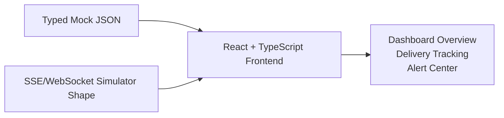
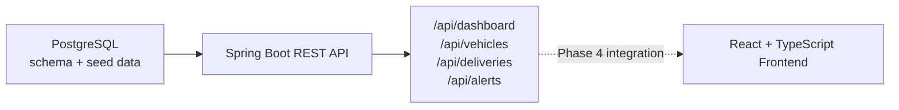
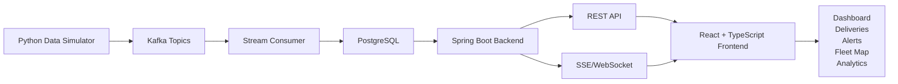

# Architecture

LogiTrack Control Tower is planned as a phased logistics dashboard architecture. The early phases prioritize a working React frontend with realistic mock data. Later phases add a Spring Boot backend, PostgreSQL, Kafka, and advanced real-time infrastructure.

## Architecture by Phase

### Phase 1-2: Frontend-First Architecture

Phase 1 and Phase 2 should keep the system simple. The frontend consumes API-shaped mock JSON and optional SSE/WebSocket simulator events.

This approach lets the project produce visible portfolio value before introducing infrastructure complexity.

### Phase 3: Backend and Database Foundation

Phase 3 introduces Spring Boot and PostgreSQL before the event pipeline. The frontend still uses mock data until Phase 4, but backend REST endpoints are ready.

### Phase 4+: Full Event Pipeline Architecture

Kafka and live event transport are introduced after the backend/database foundation and frontend API integration are working.

Kafka is not required for Phase 1 or Phase 2. It becomes useful when the project needs a realistic event pipeline and persistence layer.

## Main Layers

| Layer | Phase | Responsibility |
| --- | --- | --- |
| React frontend | Phase 2+ | Dashboard screens, routing, UI state, API consumption, live updates |
| Mock JSON | Phase 2 | API-shaped data for early frontend development |
| SSE/WebSocket simulator | Phase 2+ | Lightweight real-time behavior before Kafka |
| Spring Boot backend | Phase 3+ | REST endpoints, dashboard aggregation, future live update gateway |
| PostgreSQL | Phase 3+ | Operational records, deliveries, alerts, event history |
| Kafka | Phase 3+ | Real-time event transport for simulator and consumers |
| Stream consumer | Phase 3+ | Event validation and persistence |
| Micro-frontend shell | Later phase | Future portfolio extension, not part of Phase 1 |

## Core Entities

The first entity model should be small enough to guide frontend types and API responses without over-designing the backend.

### Vehicle

Represents a delivery vehicle.

Suggested fields:

- `id`
- `plate`
- `type`
- `capacity`
- `status`
- `currentDriverId`
- `lastLatitude`
- `lastLongitude`
- `lastSeenAt`

Common statuses:

- `AVAILABLE`
- `ON_DELIVERY`
- `DELAYED`
- `MAINTENANCE`
- `OFFLINE`

### Driver

Represents the person assigned to a vehicle or delivery.

Suggested fields:

- `id`
- `name`
- `phone`
- `rating`
- `status`

Common statuses:

- `AVAILABLE`
- `ASSIGNED`
- `OFFLINE`

### Warehouse

Represents a logistics origin or hub.

Suggested fields:

- `id`
- `name`
- `city`
- `district`
- `latitude`
- `longitude`
- `capacity`

### Delivery

Represents the main work item tracked by the dashboard.

Suggested fields:

- `id`
- `trackingNumber`
- `vehicleId`
- `driverId`
- `warehouseId`
- `region`
- `status`
- `priority`
- `estimatedDeliveryTime`
- `actualDeliveryTime`
- `delayMinutes`

Common statuses:

- `CREATED`
- `ASSIGNED`
- `IN_TRANSIT`
- `DELAYED`
- `DELIVERED`
- `CANCELLED`

Common priorities:

- `LOW`
- `NORMAL`
- `HIGH`
- `URGENT`

### VehicleLocationEvent

Represents a vehicle location update.

Suggested fields:

- `id`
- `vehicleId`
- `latitude`
- `longitude`
- `speed`
- `fuelLevel`
- `eventTime`

### DeliveryEvent

Represents a delivery status or delay event.

Suggested fields:

- `id`
- `deliveryId`
- `eventType`
- `oldStatus`
- `newStatus`
- `eventTime`

### Alert

Represents an operational issue surfaced to the user.

Suggested fields:

- `id`
- `vehicleId`
- `deliveryId`
- `alertType`
- `severity`
- `message`
- `createdAt`
- `resolvedAt`

Common severities:

- `INFO`
- `WARNING`
- `CRITICAL`

### Region

Represents a city or district used for filtering and analytics.

Suggested fields:

- `id`
- `city`
- `district`
- `riskScore`

## First Screen Data Needs

### Dashboard Overview

Needs:

- Total deliveries
- Active deliveries
- Delayed deliveries
- Active vehicles
- Active alerts
- Recent alerts
- Delivery status summary

### Delivery Tracking

Needs:

- Delivery list
- Delivery status
- Region
- Driver
- Vehicle
- ETA
- Delay minutes
- Priority

### Alert Center

Needs:

- Alert list
- Severity
- Related delivery
- Related vehicle
- Message
- Created time
- Resolved state

## Later Architecture Notes

- Fleet Map should be added after the first operational screens work.
- Analytics should be added after delivery and alert data shapes stabilize.
- Micro-frontend architecture is a later portfolio extension and should not be started in Phase 1.
- Docker Compose should remain a Phase 3 concern when backend, database, simulator, and stream consumer exist.
