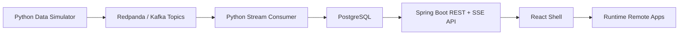
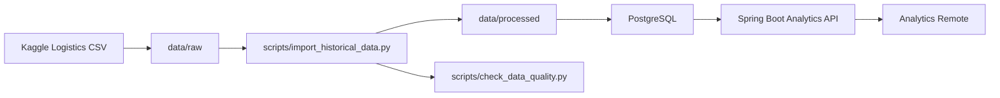

# Data Lineage

LogiTrack data moves through two complementary paths: a realtime simulator pipeline for live demo behavior and a Kaggle historical import path for analytics volume.

## Flow

1. PostgreSQL starts with schema and seed records from `database/migrations` and `database/seed`.
2. The simulator publishes logistics events to Redpanda topics.
3. The stream consumer reads events and updates PostgreSQL operational tables.
4. The backend API reads PostgreSQL for REST endpoints and periodically emits dashboard/alert snapshots over SSE.
5. The shell and remote apps use TanStack Query for REST state and subscribe to live dashboard/alert streams where needed.

## Phase 9 Historical Import Flow

1. Download the selected Kaggle CSV into `data/raw/`.
2. Run `scripts/import_historical_data.py` to normalize source columns, create deterministic IDs, and upsert regions, drivers, warehouses, vehicles, deliveries, delivery events, and location events.
3. The importer writes a normalized CSV snapshot into `data/processed/` for review.
4. Run `scripts/check_data_quality.py` against PostgreSQL.
5. Analytics reads imported rows through the existing `/api/analytics/summary` endpoint.

## Event Contract

| Event | Topic | Primary effect |
|---|---|---|
| `vehicle.location.updated` | `vehicle-location-updated` | Inserts `vehicle_location_events` and updates vehicle last known location |
| `delivery.status.changed` | `delivery-status-changed` | Updates delivery status and last updated timestamp |
| `delivery.delayed` | `delivery-delayed` | Marks delivery delayed and updates delay minutes |
| `alert.created` | `alert-created` | Inserts unresolved alert records |

## Screen Consumers

| Screen | API data |
|---|---|
| Dashboard | `/api/dashboard/summary`, `/api/live/dashboard` |
| Deliveries | `/api/deliveries` |
| Alerts | `/api/alerts`, `/api/live/alerts`, `PATCH /api/alerts/{id}/resolve` |
| Analytics | `/api/analytics/summary` |
| Fleet Map | `/api/vehicles` with snapshot polling |
| Vehicle Detail | `/api/vehicles/{id}` |
