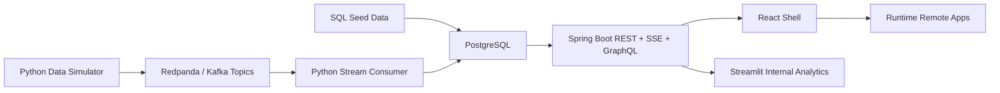
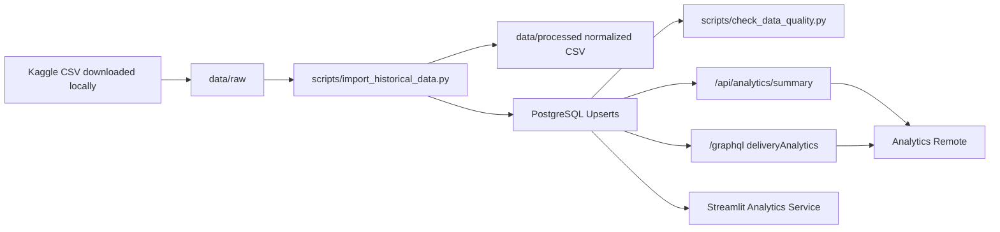

# Data Lineage

LogiTrack data moves through three paths: deterministic seed data, realtime simulator events, and a Kaggle-compatible historical import path.

## Realtime Runtime Flow

1. PostgreSQL starts with schema and seed records from `database/migrations` and `database/seed`.
2. The simulator publishes logistics events to Redpanda topics.
3. The stream consumer reads events and updates PostgreSQL operational tables.
4. The backend reads PostgreSQL for REST and GraphQL endpoints.
5. The backend emits live dashboard, alert, and vehicle snapshots over SSE.
6. The shell and remotes use TanStack Query for API state and subscribe to live streams where needed.
7. Streamlit reads PostgreSQL directly for internal data quality and analytics review.

## Kaggle Historical Import Flow

Raw Kaggle files are intentionally not committed. The committed sample fixture validates the parser path, but the large import acceptance gate requires a local raw CSV with at least 5,000 delivery rows.

## Kaggle Entity Mapping

| LogiTrack target | Import behavior |
|---|---|
| `regions` | Derived from city + district; risk score from source or synthetic fallback |
| `drivers` | Upserted from source driver name or generated historical driver |
| `warehouses` | Upserted from source warehouse/origin or generated city hub |
| `vehicles` | Upserted from vehicle plate/truck ID or generated plate |
| `deliveries` | Upserted by deterministic delivery ID and tracking number |
| `delivery_events` | Created from delivery status/delay timing where source data supports it |
| `vehicle_location_events` | Created from latest latitude/longitude and timestamp |
| `alerts` | Generated only when source delay/risk data supports an operational alert |

## Synthetic Fields

When source columns are missing, the importer may synthesize:

- Stable entity IDs
- Vehicle plates
- Driver names
- Warehouse names
- Warehouse coordinates
- Region labels
- Delivery priority
- Vehicle capacity
- Driver rating
- Risk score
- Last updated timestamp

These fields are documented in [Data quality](data-quality.md).

## Event Contract

| Event | Topic | Primary effect |
|---|---|---|
| `vehicle.location.updated` | `vehicle-location-updated` | Inserts vehicle location events and updates vehicle last known location |
| `delivery.status.changed` | `delivery-status-changed` | Updates delivery status and last updated timestamp |
| `delivery.delayed` | `delivery-delayed` | Marks delivery delayed and updates delay minutes |
| `alert.created` | `alert-created` | Inserts unresolved alert records |

## Screen Consumers

| Screen / service | Data source |
|---|---|
| Dashboard | `GET /api/dashboard/summary`, `GET /api/live/dashboard` |
| Deliveries | `GET /api/deliveries` |
| Alerts | `GET /api/alerts`, `GET /api/live/alerts`, `PATCH /api/alerts/{id}/resolve` |
| Analytics remote | `POST /graphql`, REST fallback via `GET /api/analytics/summary` |
| Fleet Map | `GET /api/vehicles`, `GET /api/live/vehicles` |
| Vehicle Detail | `GET /api/vehicles/{id}` |
| Streamlit internal analytics | Direct PostgreSQL query through `DATABASE_URL` |

## Verification Status

- Seed and simulator paths are implemented.
- REST, SSE, GraphQL, and Streamlit consumers are implemented.
- Kaggle sample import path is implemented.
- 5k+ raw Kaggle import evidence is pending.
- Browser route screenshots and profiler captures are pending.
