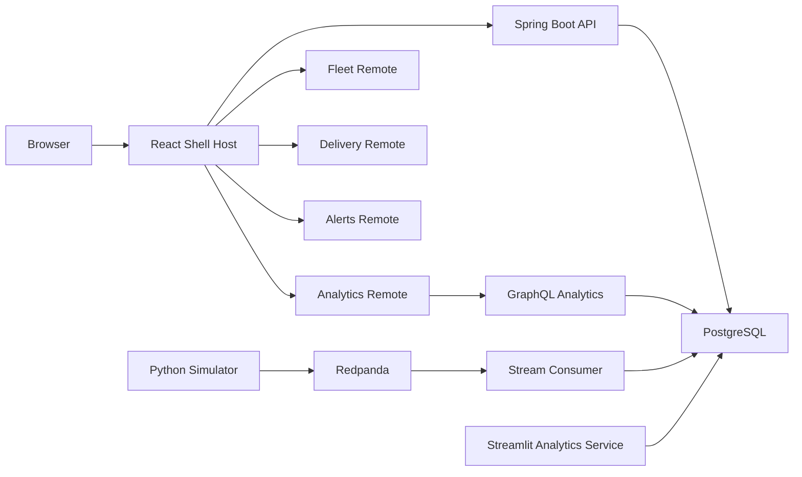
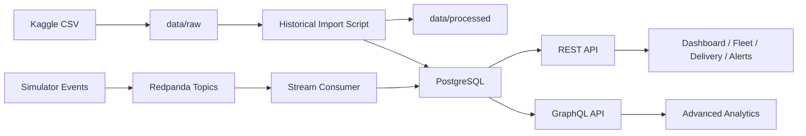
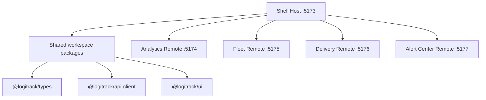

# Diagrams

## System Architecture

```mermaid
flowchart LR
  browser["Browser"] --> shell["React Shell Host"]
  shell --> analytics["Analytics Remote"]
  shell --> fleet["Fleet Remote"]
  shell --> delivery["Delivery Remote"]
  shell --> alerts["Alerts Remote"]
  shell --> api["Spring Boot API"]
  analytics --> graphql["GraphQL Analytics"]
  api --> postgres["PostgreSQL"]
  graphql --> postgres
  simulator["Python Simulator"] --> redpanda["Redpanda"]
  redpanda --> consumer["Stream Consumer"]
  consumer --> postgres
  streamlit["Streamlit Analytics Service"] --> postgres
```

## Data Pipeline

```mermaid
flowchart LR
  kaggle["Kaggle CSV"] --> raw["data/raw"]
  raw --> importer["Historical Import Script"]
  importer --> processed["data/processed"]
  importer --> postgres["PostgreSQL"]
  simulator["Simulator Events"] --> redpanda["Redpanda Topics"]
  redpanda --> consumer["Stream Consumer"]
  consumer --> postgres
  postgres --> rest["REST API"]
  postgres --> graphql["GraphQL API"]
  rest --> dashboard["Dashboard / Fleet / Delivery / Alerts"]
  graphql --> analytics["Advanced Analytics"]
```

## Micro-Frontend Architecture

```mermaid
flowchart TB
  shell["Shell Host :5173"] --> shared["Shared workspace packages"]
  shared --> types["@logitrack/types"]
  shared --> client["@logitrack/api-client"]
  shared --> ui["@logitrack/ui"]
  shell --> analytics["Analytics Remote :5174"]
  shell --> fleet["Fleet Remote :5175"]
  shell --> delivery["Delivery Remote :5176"]
  shell --> alerts["Alert Center Remote :5177"]
```
